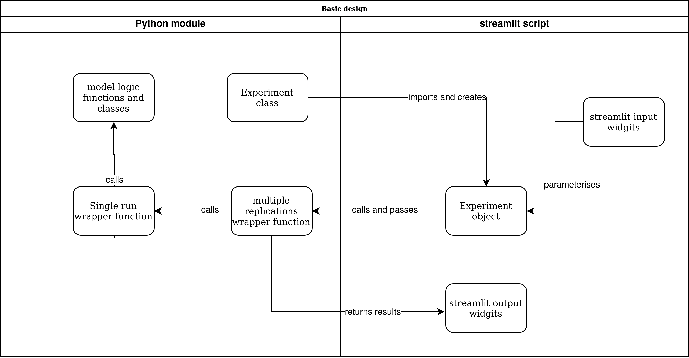

# What is streamlit?

`streamlit` is software package to build web applications in python.  It has been designed to be extremely simple to code.  A typical streamlit application is a short python script.

The web apps that you build with `streamlit` can be interactive.  Deployment of your models to users could be as simple as a local python script that provides a browser based front-end to your model, hosting the app in streamlit's free to use community cloud, or as complex as deployment to paid infrastructure such as google cloud.  In this tutorial, we will learn about building simple brower based front-ends to simulation models  that are run on local laptops or desktops.

## Why use streamlit with FOSS simulation?

The majority of discrete-event simulation studies are conducted using commercial software.  This software is very powerful and aims to be end-user friendly, but has propriety licenses that restricts sharing and adaptation for research. Free and open source software (FOSS) such as `simpy` is also powerful (and arguably more flexible), but loses a lot of the end-user friendly quality that commercial simulation software has invested in.  Adding an interactive browser based front end such, using `streamlit`, to a `simpy` model offers the best of both worlds.  

## The process to build a front-end

In this tutorial we will follow a prescribed process for creating `streamlit` front ends

1. Create and test a simulation model independently from `streamlit`
2. Design the simulation model work with an `Experiment` class and wrapper functions for running the model
3. Organise and document the simulation model code within a local python module (or python package)
4. Test all the simulation model can be parameterised and run from a simple python script
5. Enhance the script with a basic streamlit interactive front end.

