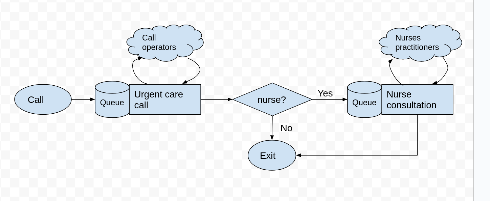

# Main concepts

The figure below illustrates the basic design of the creating a simulation model with a `streamlit` web app front end.  The diagram is illustrative and is intended to communicate the main concepts and tasks to complete. There are two files in the diagram below: a

* a python module containing the simulation model (e.g. model.py)
* a python module containing the `streamlit` script that imports functions and classes from the model module.


## Python module

A standard python module (e.g. `model.py`) that contains the simulation model and associated functions.

### Model logic, functions, classes, and constants

Modellers should build the simulation model independently from the `streamlit` front end.  It should be designed in a way that the model could be run from a standard python script, Jupyter notebook, or even a command line programme.

We provide a simple example of a simulation model in this tutorial: [the 111 urgent call centre model.](../05_solutions/04_callback.ipynb).   The model is implemented in `simpy`.  An overview of the process logic is provided in the figure below.  Call arrive at random, after a wait speak to one of a set of call operators and then either leave the model or wait for and engage in a nurse consultation. 

This is a simple model and the logic is contained within two functions `arrival_generator()` and `service()`.




### `Experiment` class

The experiment class is tightly coupled to the design of the simulation model.  It contains a configuration of the simulation model that can be executed to obtain results. Another way to describe an experiment is that it is a collection of input parameters for the simulation model.  For example, a user might set up two experiments; one containing the default number of call operators and one containing an additional call operator. The results of the experiments (such as patient waiting time and operator utilisation) can then be compared.  

### `single_run()` wrapper function

This function acts as a wrapper to running a simulated experiment and processing end of run results.  A key aspect of the design is that `single_run` accepts an instance of `Experiment`.  The listing below provides pseudo code for the design of this function. It is indicative of the general pattern you will follow; the exact details will vary depending on the simulation package in use.

```python

def single_run(experiment, run_length):
    setup_results_collection(experiment)
    model = setup_simulation_model(experiment)
    run_model(model, run_length)
    results = process_end_of_run_results(model)
    return results
  
```

### `multiple_replications()` wrapper function

The most likely usage scenario is that a model is run using multiple independent replications.  This is a simple function that accepts an `Experiment` object and the number of replications to run.  It then calls the `single_run()` function the appropriate number of times to create the distribution of results.

## The `streamlit` script

The script imports the `Experiment` class, and the `single_run()` and/or `multiple_replications()` wrapper classes from the simulation model module. This is all that is needed to enable the interaction between the front-end and the model.

### `streamlit` input widgets

The package has a number of standard input widgets available.  For example, sliders, and text boxes to allow users to vary numeric values representing model parameters, and buttons to allow users to run models.

### `Experiment` object

The script creates one ore more instances of `Experiment`. The experiment object is parameterised by the script i.e the number of operators and nurses is varied using two the values contained in `streamlit` input sliders.  


### Calling `multiple_replications()`

The interface could be setup so that a user clicks on `streamlit` button that passes a parameterised instance of `Experiment` to `multiple_replications()`  along with the number of replications to run.  

### `streamlit` output widgets

The `multiple_replications()` function should return some form of results to the `streamlit` script.  In this tutorial we return a `pandas` dataframe.  The streamlit script then uses a output widget e.g. a `streamlist.dataframe` to display the results to the user.


